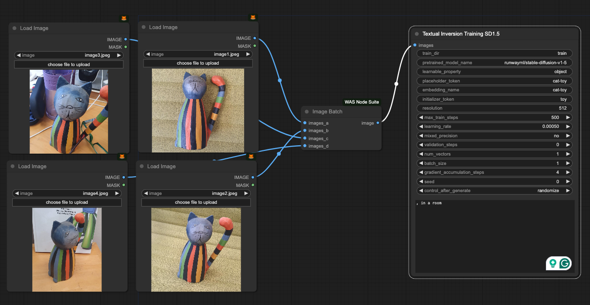

# ComfyUI Textual Inversion Training
To train textual inversion embedding directly from ComfyUI pipeline.    
Training scripts are modified version of diffusers examples: https://github.com/huggingface/diffusers/tree/main/examples/textual_inversion

## Install
Follow the installation here:
https://github.com/huggingface/diffusers/tree/main/examples/textual_inversion

Then clone the repository inside custom_nodes:  
```
git clone github.com/mbrostami/ComfyUI-TITrain
cd ComfyUI-TITrain
pip install -r requirements.txt
```

Restart and refresh the ComfyUI.
 
## Nodes
### Textual Inversion Training SD1.5
This node is designed to train SD 1.5 encoder (with progress bar)   
([./screenshot.png)[img]




## Parameters
#### train_dir
This is where the input images are going to be stored, if directory doesn't exist in `ComfyUI/output/` it will be created. Consider changing the value if you want to train different embeddings.    
#### extra_prompts 
There are list of prompts inside the training script, that is shuffled with each image to be used for training. I added this extra prompts that you can put additional prompt in each line, so randomly selected line from here will be appended to the final prompt. Usually you should put a part of prompt that you don't want to be considered as the embedding itself. (e.g. white background, close up, tattoo, etc)   


Other parameters are explained in diffusers repository: 
https://github.com/huggingface/diffusers/tree/main/examples/textual_inversion    


